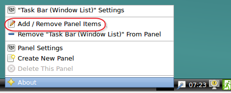
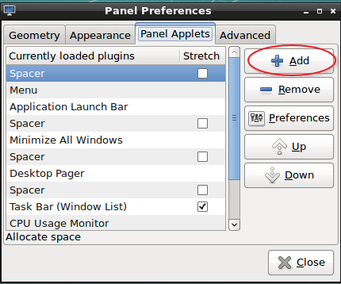
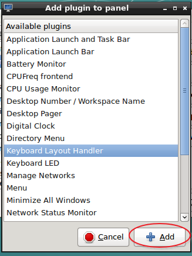
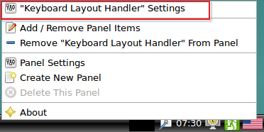
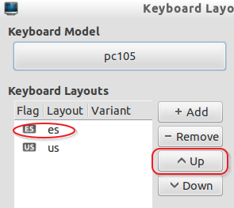
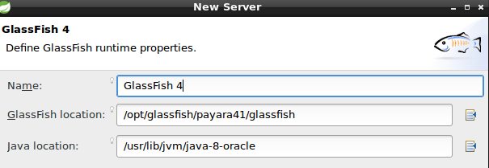

# Lab0. Configuración

La instalación y configuración de las herramientas para el desarrollo de la asignatura puede realizarse de dos maneras: manual o automática.

1. __Manual:__ útil si el alumno desea adquirir un conocimiento más profundo de las herramientas necesarias, o bien si precisa realizar una instalación limpia en su propio entorno.
2. __Automática:__ Se proporciona una imagen con las herramientas ya instaladas. Esta opción es un "_ready-to-go_", que elimina imprecisiones a la hora de realizar una instalación manual. 

<!-- MarkdownTOC depth=3 -->

- [Automática](#automática)
  - [Paso 1. Instalación de herramientas](#paso-1-instalación-de-herramientas)
  - [Paso 2. Vagrant init](#paso-2-vagrant-init)
  - [Paso 3. Modificar el fichero Vagrantfile](#paso-3-modificar-el-fichero-vagrantfile)
  - [Paso 4. Arrancar la imagen](#paso-4-arrancar-la-imagen)
  - [Cambio de idioma](#cambio-de-idioma)
  - [Paso 5. Configuración de eclipse y Glassfish/Payara Server](#paso-5-configuración-de-eclipse-y-glassfishpayara-server)
- [Manual](#manual)

<!-- /MarkdownTOC -->


> Se muestra en primera instancia la instalación automática


## Automática

### Paso 1. Instalación de herramientas

Para este escenario será necesario instalar las siguientes herramientas:

- VirtualBox ([http://www.virtualbox.org](http://www.virtualbox.org))
- Vagrant ([http://www.vagrantup.com](http://www.vagrantup.com)).
- Git bash: ([http://git-scm.com](http://git-scm.com)) __Sólo en el caso de windows__
- Opcional: VmWare, Parallels
- Opcional pero recomendado en caso de usar VirtualBox:
  - Tras la instalación de vagrant abrir una consola bash y escribir: `vagrant plugin install vagrant-vbguest`

### Paso 2. Vagrant init

- Una vez finalizada la instalación (en windows será necesario reiniciar)
- Crea un directorio llamado _uc3mtiw_
- Abre una consola de bash (Git bash en windows) y escribir el siguiente comando en ese directorio creado:

```ruby
vagrant init dpalomar/uc3mTiw
```

### Paso 3. Modificar el fichero Vagrantfile

Abrir el fichero generado (__Vagrantfile__) y descomentar la siguientes líneas de código:

```ruby

   config.vm.provider "virtualbox" do |vb|
  #   # Display the VirtualBox GUI when booting the machine
     vb.gui = true
  #
  #   # Customize the amount of memory on the VM:
     vb.memory = "2048"
   end
```

__ATENCIÓN:__ Observa como en `vb.memory` se ha cambiado el valor de __1024__ a __2048__ Esto permitirá aumentar la memoria según la RAM de tu equipo.

> Se recomienda usar 3072 o 4096. Procura nunca superar la mitad de la RAM de tu equipo.

### Paso 4. Arrancar la imagen

- Guarda los cambios en el fichero y cierra el editor.
- Ejecuta nuevamente por la consola `vagrant up` y espera a que se levante la imagen de manera gráfica.
- Una vez levantada, puedes entrar con el usuario __tiw__ _("Tecnologías informáticas para la web")_ y en el campo _password_ introduce __tiw__.

> Si has salido de la imagen haciendo un shutdown, siempre puedes volver a iniciarla escribiendo de nuevo __Vagrant up__ desde el directorio donde se encuentra el fichero Vagrantfile

### Cambio de idioma

El idioma del sistema por defecto es inglés americano, si quieres cambiar el idioma a español sigue los siguientes pasos:

1. click derecho en la barra inferior de la pantalla y selecciona _Add/Remove Panel Items_ 
2. Pulsa el botón __Add__ 
2. Selecciona _Keyboard layout handler_  y acepta
3. Click derecho en el icono de la bandera y _"Keyboard layout handler settings"_ 
3. En el nuevo cuadro de diálogo sigue la imagen: 
4. Busca en el cuadro que aparece el idioma _spain_ y click OK
5. Regresando al cuadro anterior mueve el idioma _ES_ a la primera posición 
6. Listo ya tienes traducido el sistema.

### Paso 5. Configuración de eclipse y Glassfish/Payara Server

1. Abre Eclipse desde el  __menú inicio -> programming -> STS__
2. Crea o acepta el directorio de trabajo (se recomienda llamarlo _workspace_ en un directorio con permisos).
3. Pulsa con el botón derecho del ratón dentro de la pestaña _Servers_ y elige __New -> Server__ 
4. Selecciona __Oracle -> Glassfish Tools__ y acepta. Comenzará la descarga tras aceptar una licencia
5. Cuando finalice la descarga aparecerá un diálogo indicando que es necesario reiniciar eclipse, pulsa __YES__.
6. Repite el paso 3 y elige esta vez __Glassfish -> Glassfish4 -> Next__
7. En el siguiente diálogo buscar esta ruta en:
    8. __Glassfish location:__ /opt/glassfish/payara41/glassfish
    9. __Java Location:__ /usr/lib/jvm/java-8-oracle
    10. __Next__
    11. 
10. En la sigiuente pantalla, escribe:
    11. __Admin Name:__ admin
    12. __Admin Password:__ admin
    13. __Next__
14. __Finish__

#### Probando Glassfish

> Vamos a probar que todo funcione:

1. Selecciona el servidor Glassfish y pulsa el botón verde (Start) 
2. Cuando aparezca al lado del servidor _(Started/Synchronized)_ abre un navegador a la dirección __http://localhost:8080__ y verás la página de bienvenida de _Payara Server_
3. Pulsa el botón rojo para detener el servidor
4. Sal de eclipse/STS con __File->Exit__

## Manual

Para la instalación manual será necesario los siguientes pasos:

1. Instalar JDK8 <sup id="a1">[1](#f1)</sup>
    2. Crear la variable de entorno *JAVA_HOME* apuntando al directorio _bin_ de la instalación
2. Instalar maven<sup id="a2">[2](#f2)</sup> 
    3. Crear la variable de entorno *M2_HOME* apuntando al directorio _bin_ de maven
3. Instalar Springsource ToolSuite<sup id="a3">[3](#f3)</sup>
4. Instalar MySQL<sup id="a4">[4](#f4)</sup>
    5. Usuario _root_ password _admin_
5. Instalar MySqlWorkbench<sup id="a5">[5](#f5)</sup>
6. Instalar Payara Server<sup id="a6">[6](#f6)</sup>
    7. Usuario _admin_ password _admin_
7. Instalar MySql ConnectorJ<sup id="a7">[7](#f7)</sup>
    8. Descomprimir y poner el fichero _mysql-connector-5.1.x-bin.jar_ en el directorio *$PAYARA_INSTALACION/glassfish/domains/domain1/lib*
9. _Opcional:_ instalar Docker<sup id="a8">[8](#f8)</sup>

> Se recomienda un mínimo de 3Gb RAM libres para poder funcionar correctamente.


<b id="f1">1</b> [http://www.oracle.com/technetwork/java/javase/downloads/index.html.](JDK8) [↩](#a1)
<b id="f2">2</b>: [http://maven.apache.org](http://maven.apache.org)[↩](#a2)
<b id="f3">3</b>: [http://spring.io/tools](http://spring.io/tools)[↩](#a3)
<b id="f4">4</b>: [http://www.mysql.com](http://www.mysql.com)[↩](#a4)
<b id="f5">5</b>: [http://www.mysql.com](http://www.mysql.com)[↩](#a5)
<b id="f6">6</b>: [http://www.payara.fish/](http://www.payara.fish/)[↩](#a6)
<b id="f7">7</b>: [http://www.mysql.com](http://www.mysql.com)[↩](#a7)
<b id="f8">8</b>: [http://www.docker.com](http://www.docker.com)[↩](#a8)