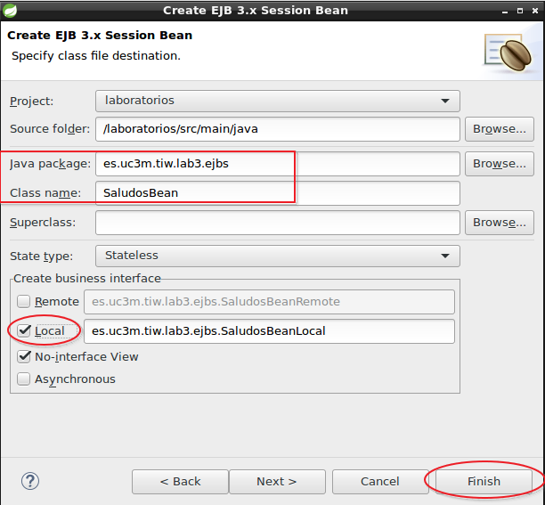
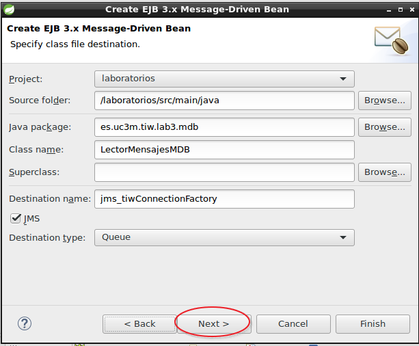
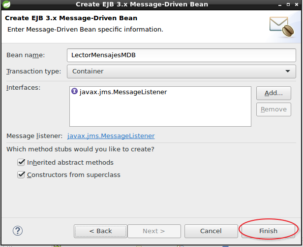

# Lab03. EJBs

> En estos ejercicios se aprenderá lo básico para el trabajo con EJBs

> La tecnología EJB siempre se ha mantenido separada del resto de módulos en la arquitectura JEE y aunque es una buena práctica en la versión __JEE7__ se permite el uso de EJBs dentro de proyectos web directamente y esta aproximación es lo que seguiremos en los siguientes ejercicios por simplicidad.
> 
> Si quieres ver un proyecto multimódulo puedes ver: [https://github.com/dpalomar/demoTIW/tree/master/demo](https://github.com/dpalomar/demoTIW/tree/master/demo).
> 
> En este caso tienes que prestar especial atención a la sección `modules` dentro de los ficheros `pom.xml` de cada proyecto que es donde se realizan las relaciones entre módulos. Además para que eclipse pueda compilar, necesita encontrar el código de cada proyecto por lo que también hay que configurar el _Build path_ de eclipse para establecer las referencias.
> 

__INDICE__
<!-- MarkdownTOC  depth=3 -->

- [Ejercicio1. EJB SessionBean](#ejercicio1-ejb-sessionbean)
- [Ejercicio2. JMS](#ejercicio2-jms)
    - [Crear la Cola JMS en Glassfish](#crear-la-cola-jms-en-glassfish)
    - [Crear el codigo.](#crear-el-codigo)
- [Ejercicio3. Refactorizacion de la persistencia](#ejercicio3-refactorizacion-de-la-persistencia)

<!-- /MarkdownTOC -->


## Ejercicio1. EJB SessionBean

> Se propone la creación de un servicio simple para demostrar el uso de `SessionBeans`. El servicio recibirá un `String` con un nombre y devolverá una cadena con un saludo concatenando el nombre. el servicio será llamado por un `Servlet` mediante el método `GET`.

1. Crea una nueva estructura de paquetes:

```java
    es.uc3m.tiw.lab3
                  ..\ejbs
                  ..\servlets
```
2. Abre el fichero __pom.xml__ y cambia en la pestaña __Dependencies__ `javaee-web-api-7.0` por `javaee-api-7.0` Acepta y Salva los cambios.
3.  
3. Dentro del paquete _ejbs_ crea un nuevo `SessionBean`  __File->New->Other->EJB->SessionBean__ y llámalo `SaludosBean`
4. 
5. Agrega un nuevo método `public String saludar(String nombre)` tanto en el interfaz `local` como en el `bean` y en este último realiza su implementación.
6. Pon como __nombre jndi__ `name="ServicioSaludos"`
6. Crea un nuevo `es.uc3m.tiw.lab3.servlets.SaludosServlet` 
    7. __Nombre:__ SaludosServlet
    8. __URL Mapping:__ /bienvenida
    9. __Métodos:__ doGet
10. En el servlet utiliza la anotación `@EJB` para usar el servicio `SaludosBean`
11. Recupera el parámetro _nombre_ que viene por GET 
12. invoca el servicio con ese parámetro  y muestra el mensaje en el navegador.
    13. La URL será: http://localhost:8080/laboratorios/bienvenida?nombre=xxx

> Para este ejercicio la documentación recomendada es el tutorial oficial de JEE7 <sup id="a1">[1](#f1)</sup>

## Ejercicio2. JMS

### Crear la Cola JMS en Glassfish

1. abre la consola de administración de Glassfish/Payara
2. Busca __JMS Resources->ConnectionFactories__
3. 
4. Ahora __JMS Resources ->Destination Resources__
5. 

### Crear el codigo.

1. __File->New->Other->EJB->Message Drive Bean__
2. 
3. 
4. Crea un nuevo dominio y llámalo `Mensaje` anótalo como `@Entity` y pon las siguientes propiedades:

```java
    @Id
    @GeneratedValue(strategy = AUTO)
    private Long id;
    private String mensaje;
    @OneToOne
    private Usuario from;
    @OneToOne
    private Usuario to;
```

5. Crea los correspondientes __DAOs__ para el `Mensaje` con dos métodos:
    6. `findAllMessagesByUsuario(Usuario usuario)`: recuperará todos los mensajes para un usuario dado.
    7. `createMensaje(Mensaje mensaje)`: persistirá el mensaje en la tabla `MENSAJES` con las referencias a las claves de los usuarios.
8. Crea una clase `es.uc3m.tiw.lab3.util.EscribirEnCola` que permita mandar mensajes a la cola configurada anteriormente
9. Crea un formulario de envío de mensajes y un servlet que reciba los parámetros cree un `Mensaje` e invoque a `EscribirEnCola`

> El escenario es el siguiente:
> - Un usuario escribe un mensaje a otro mediante el formulario.
> - El servlet recibe los parámetros,crea el mensaje e invoca el servicio `EscribeEnCola` que envía el mensaje a la cola del servidor
> - En cuanto llega el mensaje a la cola, el `LectorMensajesMDB` recibe automáticamente el mensaje (porque es un Listener)
> - `LectorMensajesMDB` extrae el `Mensaje` y se lo pasa al `MensajesDAO` que lo escribe en una tabla.
> - Fin.

## Ejercicio3. Refactorizacion de la persistencia

> En este ejercicio se propone convertir todos los DAOs a EJBs de session.
> Esto permitirá que los DAOs participen del entorno transaccional del servidor y por tanto no será necesario que usen el `UserTransaction`, tampoco tienen que esperar que los Servlets carguen el `EntityManager` ya que al ser EJBs puede usar la anotación `@PersistenceContext` directamente.
> 
> Por tanto, se propone al alumno la refactorización de los DAOs y convertirlos a `SessionBeans` locales 

1. Modifica todos los DAOs para que usen anotaciones `@Local` y `@SessionBean` lo mismo para sus interfaces, siguiendo el procedimiento del primer ejercicio.
2. Modifica su código para que ahora no necesiten el `UserTransaction`
3. Modifica su código para que ahora invoquen ellos mismos el `EntityManager`
4. Cambia el código de los servlets para que ahora invoquen los DAOs como `@EJB` sin necesidad de pasarles el EntityManager ni el UserTransaction.


<b id="f1">1</b>: [Tutorial EJBs](https://docs.oracle.com/javaee/7/tutorial/partentbeans.htm#BNBLR)[↩](#a1)